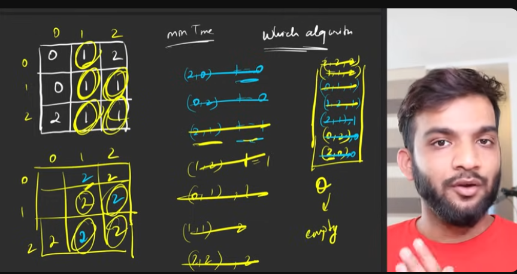

## Rotten Oranges leetcode-994


```cpp
class Solution {
public:
    int orangesRotting(vector<vector<int>>& grid) {
        int n = grid.size();
        int m = grid[0].size();
        queue<pair<pair<int, int>, int>> q;

        // Step 1: Push all initially rotten oranges into the queue
        for (int i = 0; i < n; i++) {
            for (int j = 0; j < m; j++) {
                if (grid[i][j] == 2) {
                    q.push({{i, j}, 0});
                }
            }
        }

        int tm = 0;
        int drow[] = {-1, 0, 1, 0};
        int dcol[] = {0, 1, 0, -1};

        // Step 2: BFS to rot adjacent fresh oranges
        while (!q.empty()) {
            int r = q.front().first.first;
            int c = q.front().first.second;
            int t = q.front().second;
            tm = max(tm, t);
            q.pop();

            for (int i = 0; i < 4; i++) {
                int nrow = r + drow[i];
                int ncol = c + dcol[i];

                if (nrow >= 0 && nrow < n && ncol >= 0 && ncol < m && grid[nrow][ncol] == 1) {
                    grid[nrow][ncol] = 2; // Mark it as rotten
                    q.push({{nrow, ncol}, t + 1});
                }
            }
        }

        // Step 3: Check for remaining fresh oranges
        for (int i = 0; i < n; i++) {
            for (int j = 0; j < m; j++) {
                if (grid[i][j] == 1) return -1;
            }
        }

        return tm;
    }
};

```