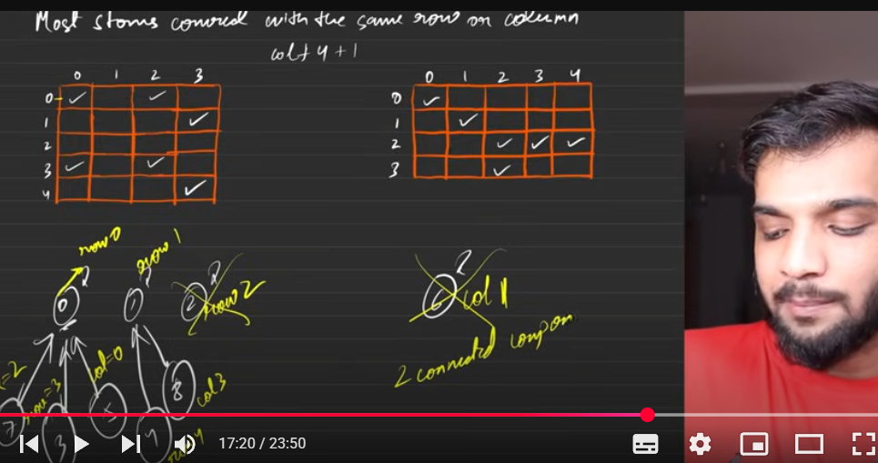

## Stone Removal Problem - Disjoint Set Union Approach

### Problem Samjhiye:
Hume stones remove karne hain agar same row ya column mein koi aur stone hai. Maximum kitne stones remove kar sakte hain?

### Approach:
- DSU use karke rows aur columns ko connect karte hain
- Agar stones same row/column mein hain to unhe same component mein consider karte hain
- Final answer = Total stones - Number of connected components

```cpp
class DisjointSet{
public:
    vector<int>size,parent;
    
    // Constructor - har node ka parent khud ko set karta hai
    DisjointSet(int n){
        size.resize(n,1);           // Initially har component ka size 1
        parent.resize(n,0);
        for(int i=0;i<n;i++){
            parent[i]=i;            // Har node apna parent hai initially
        }
    }

    // Path compression ke saath ultimate parent find karta hai
    int findUPar(int node){
        if(parent[node]==node)return node;
        return parent[node]=findUPar(parent[node]);  // Path compression
    }

    // Size ke basis pe union karta hai (smaller ko larger se attach)
    void unionBySize(int u, int v){
        int ulpu=findUPar(u);       // u ka ultimate parent
        int ulpv=findUPar(v);       // v ka ultimate parent

        if(ulpu==ulpv) return;      // Already same component mein hain

        // Smaller size wale ko larger size wale se attach karo
        if(size[ulpu]<size[ulpv]){
            parent[ulpu]=ulpv;
            size[ulpv]+=size[ulpu];
        }else{
            parent[ulpv]=ulpu;
            size[ulpu]+=size[ulpv];
        }
    }
};

class Solution {
public:
    int removeStones(vector<vector<int>>& stones) {
        int n = stones.size();
        int maxRow = 0, maxCol = 0;

        // Maximum row aur column find karte hain
        for (auto& stone : stones) {
            maxRow = max(maxRow, stone[0]);
            maxCol = max(maxCol, stone[1]);
        }

        // DSU banate hain rows + columns ke liye
        // Total nodes = maxRow + maxCol + 2
        DisjointSet ds(maxRow + maxCol + 2);
        unordered_map<int, int> uniqueNodes;

        // Har stone ke liye row aur column ko connect karte hain
        for (auto& stone : stones) {
            int rowNode = stone[0];              // Row number as node
            int colNode = stone[1] + maxRow + 1; // Column number + offset
            
            // Same stone ki row aur column ko connect kar dete hain
            ds.unionBySize(rowNode, colNode);
            
            // Track karte hain ki ye nodes use hui hain
            uniqueNodes[rowNode] = 1;
            uniqueNodes[colNode] = 1;
        }

        // Connected components count karte hain
        int cnt = 0;
        for (auto& it : uniqueNodes) {
            // Agar node khud ka parent hai to ye component ka head hai
            if (ds.findUPar(it.first) == it.first) {
                cnt++;
            }
        }

        // Answer = Total stones - Connected components
        // Kyunki har component mein se 1 stone bachana padega
        return n - cnt;
    }
};
```

### Key Points:
1. **Node Mapping**: Row numbers directly use karte hain, column numbers ko `maxRow + 1` se offset dete hain
2. **Union Logic**: Har stone ki row aur column ko connect karte hain
3. **Final Calculation**: `Total stones - Connected components` = Maximum removable stones
4. **Time Complexity**: O(N * α(N)) where α is inverse Ackermann function
5. **Space Complexity**: O(maxRow + maxCol)

