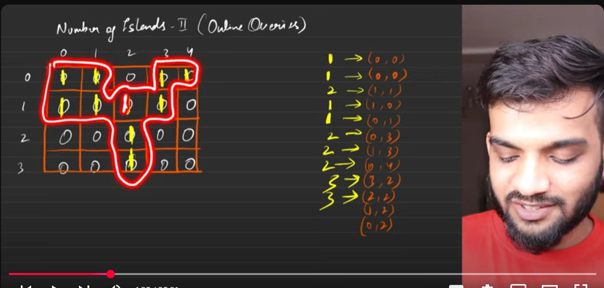

```cpp
class DisjointSet{
public:
    vector<int> size, parent;

    DisjointSet(int n){
        parent.resize(n+1);
        size.resize(n+1, 1);
        for(int i = 0; i <= n; i++){
            parent[i] = i;
        }
    }

    int findUPar(int node){
        if(node == parent[node]) return node;
        return parent[node] = findUPar(parent[node]);
    }

    void unionBySize(int u, int v){
        int ulp_u = findUPar(u);
        int ulp_v = findUPar(v);
        if(ulp_u == ulp_v) return;

        if(size[ulp_u] < size[ulp_v]){
            parent[ulp_u] = ulp_v;
            size[ulp_v] += size[ulp_u];
        } else {
            parent[ulp_v] = ulp_u;
            size[ulp_u] += size[ulp_v];
        }
    }
};

class Solution {
public:
    bool isValid(int adjr, int adjc, int n, int m){
        return (adjr >= 0 && adjr < n && adjc >= 0 && adjc < m);
    }

    vector<int> numOfIslands(int n, int m, vector<vector<int>> &operators) {
        DisjointSet ds(n * m);
        vector<vector<int>> vis(n, vector<int>(m, 0));
        int cnt = 0;
        vector<int> ans;

        for(auto it : operators){
            int row = it[0];
            int col = it[1];

            if(vis[row][col] == 1){
                ans.push_back(cnt);
                continue;
            }

            vis[row][col] = 1;
            cnt++;

            int dr[] = {-1, 0, 1, 0};
            int dc[] = {0, 1, 0, -1};

            for(int ind = 0; ind < 4; ind++){
                int adjr = row + dr[ind];
                int adjc = col + dc[ind];

                if(isValid(adjr, adjc, n, m) && vis[adjr][adjc] == 1){
                    int nodeNo = row * m + col;
                    int adjNodeNo = adjr * m + adjc;
                    if(ds.findUPar(nodeNo) != ds.findUPar(adjNodeNo)){
                        cnt--;
                        ds.unionBySize(nodeNo, adjNodeNo);
                    }
                }
            }

            ans.push_back(cnt);
        }

        return ans;
    }
};

```